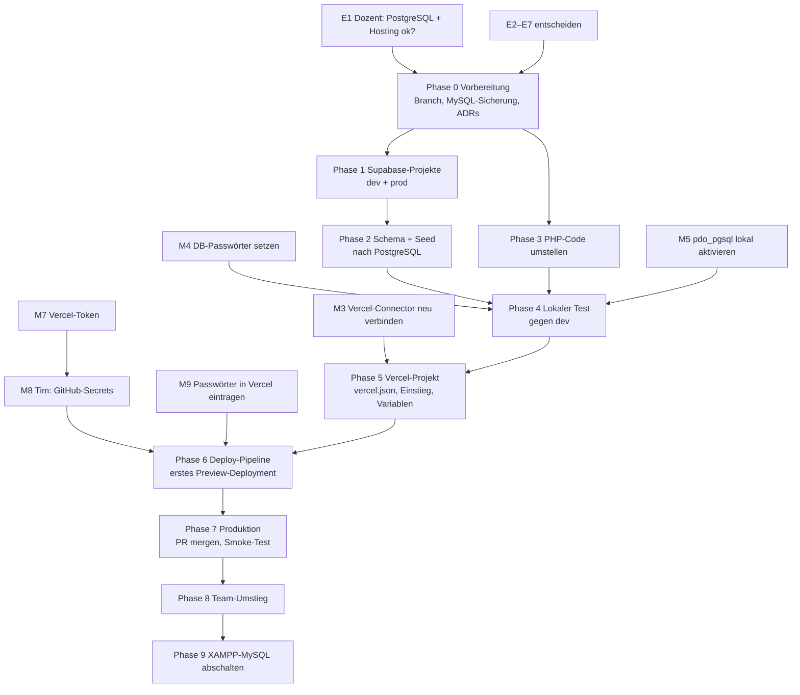

# Migrationsplan: XAMPP → Vercel + Supabase

Stand 30.09.2026 · erstellt mit Claude Code für Jonathan · Status: **in Umsetzung**

## Stand der Umsetzung

| | Erledigt |
|---|---|
| Entscheidungen | E1 Dozent: ja · E2: GitHub Actions, Repo ist öffentlich · E3–E7 wie empfohlen |
| Vercel | Connector verbunden, Projekt `schwitzkasten` (Node 22.x, fra1), nicht-geheime Variablen gesetzt, Secrets im Repo (Tim) |
| Supabase | `schwitzkasten-dev` (eu-central-1) mit Schema, Seed, RLS, Zeitzone; Zeilenzahlen = MySQL |
| Code | Branch `feature/vercel-supabase`: Schema/Seed PostgreSQL, 6 Repositories, Sitzungen in der DB, Konfiguration aus Umgebungsvariablen, `api/index.php`, `vercel.json`, Workflow, ADR-0016/0017, Doku |
| **Offen** | Produktionsdatenbank (Supabase-Limit, siehe unten) · DB-Passwort setzen (M4/M6/M9) · lokaler Test · PR + Preview · Produktion |

**Blocker Produktionsdatenbank:** Supabase lehnt ein zweites kostenloses
Projekt ab, weil Tim als Admin der Organisation sein Limit von zwei aktiven
Free-Projekten (über alle seine Organisationen) erreicht hat.

Ziel: Die Website läuft nicht mehr lokal über XAMPP, sondern öffentlich
erreichbar auf **Vercel** (PHP-Seiten und Endpunkte) mit den Daten in
**Supabase** (PostgreSQL). Lokales Entwickeln mit `start.bat` bleibt möglich.

---

## 0. Kurzfassung

| | Heute | Nachher |
|---|---|---|
| Webserver | PHP-Server aus XAMPP (`start.bat`), Apache zur Abgabe | Vercel, PHP über die Community-Laufzeit `vercel-php` |
| Datenbank | MySQL aus XAMPP, Datenbank `schwitzkasten` | Supabase PostgreSQL, Region Frankfurt |
| Login-Sitzungen | PHP-Dateien auf der Festplatte | Tabelle `sitzungen` in der Datenbank |
| Zugangsdaten | `config/config.php` (nicht in Git) | lokal weiter `config/config.php`, auf Vercel Umgebungsvariablen |
| Deployment | Ordner kopieren | Push/PR → Vercel baut automatisch |

**Was sich nicht ändert:** die sechs Schichten, PHP ohne Framework, kein
Build-Schritt im Projekt, die Login-Bibliothek `delight-im/auth`, alle Seiten,
das gesamte JavaScript und CSS. Supabase wird **nur als PostgreSQL-Datenbank**
benutzt – kein Supabase-Auth, keine Supabase-JS-Bibliothek, kein `fetch()` am
Service-Layer vorbei.

**Die drei größten Brocken:**

1. **SQL-Dialekt.** MySQL → PostgreSQL: `schema.sql`, `seed.sql` und sechs
   Repositories müssen angepasst werden (Tabelle in Abschnitt 5).
2. **Sitzungen.** Vercel-Funktionen haben keine gemeinsame Festplatte. PHP-
   Sitzungen in Dateien gehen zwischen zwei Aufrufen verloren → Login würde
   zufällig „vergessen". Lösung: Sitzungen in einer Datenbanktabelle.
3. **Git-Anbindung.** Das Repo `TimSoell/Webprogrammierung` ist **privat** und
   gehört **Tim**. Vercel Hobby lässt nur den Repo-Eigentümer verbinden und nur
   den Vercel-Kontoinhaber deployen. Dafür braucht es eine Entscheidung (E2).

---

## 1. Befund (Ist-Zustand, geprüft am 30.09.2026)

| Punkt | Befund |
|---|---|
| Code | PHP 8, 14 Endpunkte in `api/`, 12 Repositories, 20 Tabellen |
| PHP lokal | XAMPP PHP **8.2.12**; `php_pdo_pgsql.dll` und `libpq.dll` vorhanden, aber in `php.ini` **auskommentiert** |
| MySQL lokal | läuft; Datenbank `schwitzkasten` enthält nur Testdaten: 1 Konto, 1 Mitglied, 2 Mitgliedschaften, 1 Kursbuchung, Rest = Seed-Daten |
| Login-Bibliothek | `delight-im/auth` v9.0.0 bringt ein **offizielles PostgreSQL-Schema** mit (`vendor/delight-im/auth/Database/PostgreSQL.sql`) |
| Werkzeuge lokal | `git` ja; **kein** Node.js, `vercel`-CLI, `gh`, `supabase`-CLI, `psql`, Docker |
| Supabase | Organisation „Schwitzkasten" (Free), **0 Projekte**. Neues Projekt kostet 0 $/Monat |
| Vercel | Konto `jonathan25017`, Plan **Hobby**, Team-Scope `schwitzkasten`. **Der Vercel-Connector in Claude hat keinen Zugriff auf diesen Scope (403)** → muss neu verbunden werden |
| GitHub | `TimSoell/Webprogrammierung`, privat, Eigentümer Tim (persönliches Konto) |
| `vercel-php` | aktuell `vercel-php@0.9.0` = PHP 8.5, enthält `pdo_pgsql`, `curl`, `mbstring`, `session`; Dateien müssen unter `api/` liegen; läuft intern mit dem PHP-Entwicklungsserver |

### Stellen im Code, die auf Vercel oder PostgreSQL brechen würden

| Stelle | Problem |
|---|---|
| [`src/Database.php:60`](../src/Database.php) | DSN `mysql:` |
| [`src/Auth.php:66`](../src/Auth.php) | eigener DSN `mysql:` für die Bibliothek |
| [`src/bootstrap.php:27`](../src/bootstrap.php), `Database.php:55`, `Auth.php:61` | lesen `config/config.php` – die gibt es auf Vercel nicht |
| [`src/bootstrap.php:97`](../src/bootstrap.php) | Sitzung in Dateien → auf Vercel nicht haltbar |
| `src/bootstrap.php` | keine Zeitzone gesetzt. Lokal kommt `Europe/Berlin` aus der XAMPP-`php.ini`, auf Vercel wäre es **UTC** → `new DateTimeImmutable('today')` in `api/nachweise.php` und die Auslastung liefen um 1–2 Stunden falsch |
| `src/bootstrap.php:50` | `BASE_URL` wird aus `DOCUMENT_ROOT` berechnet – auf Vercel nachprüfen |
| Login-Drosselung | Hinter dem Vercel-Proxy sieht PHP evtl. `127.0.0.1` als Absender → **alle Besucher teilen sich einen Drosselungs-Zähler** und sperren sich gegenseitig aus |
| [`MitgliedAuswahlRepository.php:43`](../src/Repositories/MitgliedAuswahlRepository.php) | `ON DUPLICATE KEY UPDATE` |
| [`MitgliedschaftRepository.php`](../src/Repositories/MitgliedschaftRepository.php) Z. 60–261 | `CURDATE()`, `LAST_DAY()`, `+ INTERVAL 1 DAY` |
| [`NachweisRepository.php:64,95`](../src/Repositories/NachweisRepository.php) | `CURDATE()` |
| [`AuslastungRepository.php:229`](../src/Repositories/AuslastungRepository.php) | `NOW()` gegen Spalte ohne Zeitzone |
| [`ProbetrainingRepository.php:98,128,150`](../src/Repositories/ProbetrainingRepository.php) | `DATE(...)`, Fehlercode `23000` |
| [`KursbuchungRepository.php:85`](../src/Repositories/KursbuchungRepository.php) | Fehlercode `23000` (PostgreSQL: `23505`) |
| [`database/seed.sql`](../database/seed.sql) | Backticks, `ON DUPLICATE KEY UPDATE`, `COLLATE utf8mb4_unicode_ci`, Uhrzeiten als untypisierte Texte in `UNION ALL` |
| [`api/nachweise.php:53`](../api/nachweise.php) | erlaubt 4 MB Bild → als Base64 ≈ 5,4 MB; Vercel nimmt höchstens **4,5 MB je Anfrage** an. (In der Praxis verkleinert `assets/js/lib/bild.js` vorher, Grenze trotzdem anpassen) |
| [`api/passwort-reset.php:77`](../api/passwort-reset.php) | zeigt im Debug-Modus den Reset-Link an. **Öffentlich im Netz = jeder kann jedes Konto übernehmen** |

---

## 2. Entscheidungen vor dem Start

Diese Punkte kann ich nicht für euch entscheiden. Meine Empfehlung steht
jeweils dabei.

| # | Frage | Empfehlung |
|---|---|---|
| **E1** | **Ist PostgreSQL statt MySQL und eine gehostete Abgabe statt XAMPP für die Studienarbeit erlaubt?** Supabase ist ausschließlich PostgreSQL. Die Projektbeschreibung nennt „PHP 8, MySQL über PDO" und „Apache zur Abgabe". | **Vor allem anderen beim Dozenten klären.** Ist MySQL Pflicht, ist Supabase die falsche Wahl – dann nur Vercel + ein MySQL-Anbieter. |
| **E2** | Wie kommt der Code auf Vercel? (Repo privat, gehört Tim, Vercel = Hobby) | **Option C** (siehe unten) |
| **E3** | Bestehende Daten übernehmen oder neu anfangen? | **Neu anfangen.** Lokal steht nur ein Testkonto; Katalogdaten kommen aus `seed.sql`. |
| **E4** | „Passwort vergessen" in Produktion? | Reset-Link **nicht** mehr auf der Seite anzeigen. Eigener Schalter `DEMO_RESET_LINK`, in Produktion aus, in Preview/lokal an. Echte E-Mails (z. B. über einen Mail-Dienst) später als eigenes Feature. |
| **E5** | KI-Ausweisprüfung (Gemini) in Produktion? | **In Produktion ohne Schlüssel** (Demo-Modus). Grund: öffentliche Seite + kostenlose Gemini-Stufe = echte Ausweise Fremder könnten bei Google landen (ADR-0012). Für Vorführungen den Schlüssel nur in Preview setzen. |
| **E6** | Wer darf Preview-Deployments sehen? Auf Hobby schützt Vercel Previews standardmäßig mit Vercel-Login – das Team hat aber keine Vercel-Konten im Scope. | Schutz für Previews **ausschalten**; Produktion bekommt `X-Robots-Tag: noindex`, damit das fiktive Studio nicht bei Google auftaucht. |
| **E7** | Zweite Datenbank für Entwicklung? | **Ja:** `schwitzkasten-dev` (auch 0 $). Lokal und Preview → dev, nur `main` → Produktion. `seed.sql` löscht Buchungen und darf nie gegen Produktion laufen. |

### E2 im Detail – drei Wege

Fakten laut Vercel-Doku: *Ein Repo eines persönlichen GitHub-Kontos kann nur
dessen Eigentümer mit Vercel verbinden.* Und: *Auf Hobby kann nur der
Kontoinhaber Deployments auslösen.* Hobby kann außerdem keine Repos von
GitHub-Organisationen verbinden.

| | Weg | Aufwand | Nachteil |
|---|---|---|---|
| A | Tim legt ein eigenes Vercel-Konto an und verbindet das Repo | gering | Claude (dein Vercel-Konto) kann nichts verwalten; Deploys nur, wenn **Tim** mergt; Previews der anderen blockiert |
| B | Tim überträgt das Repo auf dein GitHub-Konto | gering | Eigentum wechselt; Deploys nur, wenn **du** mergst |
| **C** | **GitHub Actions deployt mit deinem Vercel-Token** (`vercel deploy` im Workflow) | mittel | Tim muss einmal drei Secrets im Repo anlegen; Node.js läuft nur in GitHub Actions, nicht im Projekt |
| D | Vercel Pro | gering | 20 $ pro Person und Monat |

**Empfehlung C:** Vercel bleibt in deinem Konto (von Claude verwaltbar), und
jeder im Team arbeitet weiter per PR. GitHub Actions ist für private Repos bis
2.000 Minuten/Monat kostenlos; ein Deploy braucht etwa eine Minute.

**Einschränkung (nachgeprüft am 30.09.2026):** Auch bei Deploys über die CLI
prüft Vercel auf Hobby den **Autor des neuesten Commits** – er muss der
Kontoinhaber sein ([Vercel-Doku](https://vercel.com/docs/deployments/troubleshoot-project-collaboration)).
Deine Commit-Adresse `wi25017@lehre.dhbw-stuttgart.de` passt zu deinem
Vercel-Konto. Daraus folgt:

- Produktion geht nur live, wenn **du** nach `main` mergst, und zwar mit
  „Create a merge commit" (bei „Squash" wäre der PR-Autor der Commit-Autor).
- Previews für PRs der anderen schlagen fehl.
- Ausweg ohne Einschränkung: Repo **öffentlich** machen (laut Vercel ist
  Zusammenarbeit bei öffentlichen Repos kostenlos) oder Vercel Pro.
- Es gibt Anleitungen, die im CI den Commit-Autor umschreiben. Das umgeht die
  Hobby-Einschränkung absichtlich – nicht empfohlen.

---

## 3. Zielarchitektur

```
Browser
  │
  ├─ /assets/…  ─────────────►  Vercel CDN (statisch: CSS, JS, Bilder, Videos mit Range)
  │
  └─ alles andere ─►  Vercel-Funktion api/index.php   (vercel-php, PHP 8.5, Region fra1)
                         │  Einstieg nur für Vercel: prüft den Pfad gegen eine
                         │  Positivliste und bindet die vorhandene Datei ein
                         ▼
                      index.php · mein-konto.php · programme/*.php · api/*.php   (Schicht 1 / 4)
                         ▼
                      src/Repositories/*   (Schicht 5)
                         ▼  PDO pgsql, sslmode=require
                      Supavisor-Pooler, Session-Modus, Port 5432 (IPv4)
                         ▼
                      Supabase PostgreSQL, eu-central-1 (Frankfurt)   (Schicht 6)
```

**Warum eine einzige Funktion statt 15?** Eine Funktion bleibt öfter „warm"
(weniger Kaltstarts), Vercel stellt `src/`, `vendor/` und `config/` nicht
versehentlich als Quelltext aus, und die Schichten bleiben unverändert – die
Seiten und Endpunkte werden nur eingebunden, nicht verschoben.

**Warum Pooler im Session-Modus (5432) und nicht Transaktions-Modus (6543)?**
Die Login-Bibliothek erzwingt echte Prepared Statements
(`delight-im/db/src/PdoDatabase.php:67`). Der Transaktions-Modus unterstützt
die laut Supabase-Doku nicht. Die direkte Verbindung
`db.<ref>.supabase.co` ist im Free-Plan nur per IPv6 erreichbar.

### Umgebungen

| Umgebung | Auslöser | Datenbank | `APP_DEBUG` | `DEMO_RESET_LINK` | Gemini |
|---|---|---|---|---|---|
| Lokal | `start.bat` | `schwitzkasten-dev` | 1 | 1 | optional |
| Preview | jeder PR / Branch | `schwitzkasten-dev` | 0 | 1 | optional |
| Produktion | Merge auf `main` | `schwitzkasten` | 0 | 0 | aus (E5) |

### Umgebungsvariablen auf Vercel

| Variable | Wert | setzt |
|---|---|---|
| `DB_HOST` | `aws-…-eu-central-1.pooler.supabase.com` (aus dem Connect-Dialog) | Claude |
| `DB_PORT` | `5432` | Claude |
| `DB_NAME` | `postgres` | Claude |
| `DB_USER` | `postgres.<projekt-ref>` – je Umgebung eigenes Projekt | Claude |
| `DB_PASSWORD` | Datenbank-Passwort, Typ *Sensitive* | **du** (Dashboard) |
| `APP_DEBUG` | `0` | Claude |
| `DEMO_RESET_LINK` | `0` / `1` | Claude |
| `GEMINI_API_KEY` | nur falls gewünscht, Typ *Sensitive* | **du** (Dashboard) |
| `GEMINI_MODELL` | leer oder Modellname | Claude |

---

## 4. Phasen und Abhängigkeiten



Phase 2 und Phase 3 können parallel laufen. Doku-Änderungen passieren nach
CLAUDE.md §5.5 **im selben Commit** wie die Code-Änderung, nicht als eigene
Phase. Alles läuft auf einem Branch `feature/vercel-supabase` und geht als
**ein PR** nach `main`.

Legende „Wer": **C** = Claude, **Du** = Jonathan, **Tim**, **Team** = alle.

### Phase 0 – Vorbereitung

| Schritt | Was | Wer | hängt ab von | Fertig, wenn |
|---|---|---|---|---|
| 0.1 | E1 mit dem Dozenten klären | Team | – | schriftliche Zusage |
| 0.2 | E2–E7 entscheiden | Team | – | Tabelle oben abgehakt |
| 0.3 | Vercel-Connector in Claude neu verbinden, Zugriff auf Scope `schwitzkasten` erlauben (M3) | Du | – | `list_teams` liefert das Team |
| 0.4 | Branch `feature/vercel-supabase` von aktuellem `main` anlegen | C | – | Branch existiert |
| 0.5 | Sicherung der lokalen MySQL-Datenbank per `mysqldump` nach außerhalb des Repos | C | – | `.sql`-Datei vorhanden |
| 0.6 | **ADR-0016** „Hosting auf Vercel mit vercel-php" und **ADR-0017** „PostgreSQL auf Supabase, Sitzungen in der Datenbank" schreiben; in **ADR-0004** Status auf „teilweise ersetzt durch ADR-0016" | C | 0.2 | ADRs im Branch |

### Phase 1 – Supabase einrichten

| Schritt | Was | Wer | hängt ab von | Fertig, wenn |
|---|---|---|---|---|
| 1.1 | Kosten bestätigen (0 $) und Projekt `schwitzkasten-dev` in `eu-central-1` anlegen | C (MCP) | 0.1 | Status `ACTIVE_HEALTHY` |
| 1.2 | Projekt `schwitzkasten` (Produktion) ebenso anlegen | C (MCP) | 0.1 | Status `ACTIVE_HEALTHY` |
| 1.3 | **Datenbank-Passwort** für beide Projekte setzen: Dashboard → Project Settings → Database → *Reset database password*. In einen Passwortmanager, **nicht** in den Chat (M4) | Du | 1.1, 1.2 | Passwörter liegen sicher ab |
| 1.4 | Zeitzone der Datenbank: `ALTER DATABASE postgres SET timezone TO 'Europe/Berlin'` (beide Projekte) | C (MCP) | 1.1, 1.2 | `SHOW timezone` = Europe/Berlin |
| 1.5 | Pooler-Host (Session-Modus) aus dem Connect-Dialog notieren | Du/C | 1.1 | Host bekannt |

### Phase 2 – Schema und Testdaten nach PostgreSQL

| Schritt | Was | Wer | hängt ab von | Fertig, wenn |
|---|---|---|---|---|
| 2.1 | `database/schema.sql` in PostgreSQL-Syntax neu schreiben (Abschnitt 5). Die acht `users*`-Tabellen **wortgleich** aus `vendor/delight-im/auth/Database/PostgreSQL.sql`, dazu unsere Fremdschlüssel. Datei bleibt wiederholbar (`IF NOT EXISTS`) | C | 0.4 | Datei fertig |
| 2.2 | Neue Tabelle `sitzungen (id text PRIMARY KEY, daten text NOT NULL, zuletzt integer NOT NULL)` + Index auf `zuletzt` | C | 2.1 | in `schema.sql` |
| 2.3 | **Row Level Security auf allen Tabellen einschalten, ohne Policies.** Unsere App verbindet sich als Tabelleneigentümer und ist nicht betroffen; die öffentliche Supabase-REST-Schnittstelle mit dem anon-Schlüssel bekommt dadurch **nichts** zu sehen (sonst wären z. B. Passwort-Hashes aus `users` abrufbar) | C | 2.1 | in `schema.sql` |
| 2.4 | `database/seed.sql` umschreiben: Backticks weg, `ON CONFLICT … DO UPDATE`, `COLLATE` weg, `'07:00:00'::time` usw. | C | 2.1 | Datei fertig |
| 2.5 | Schema per `apply_migration` in **dev** einspielen, Seed per `execute_sql` | C (MCP) | 1.1, 2.1–2.4 | ohne Fehler |
| 2.6 | Prüfen: Zeilenzahlen wie lokal (programme 3, merkmale 21, coaches 9, tarife 4, auslastung_basis 168, kurstermine 18, verfuegbarkeiten 18) und `get_advisors` (Sicherheit) ohne Fehler | C (MCP) | 2.5 | Zahlen stimmen, keine Advisor-Fehler |
| 2.7 | `database/README.md` auf PostgreSQL/Supabase umschreiben | C | 2.5 | im selben Commit |

### Phase 3 – PHP-Code umstellen

| Schritt | Datei | Änderung | Wer |
|---|---|---|---|
| 3.1 | `src/bootstrap.php` | Konfiguration **einmal** laden: `config/config.php`, falls vorhanden, sonst aus Umgebungsvariablen (neue, eingecheckte Datei `config/config.umgebung.php` ohne Werte). `Database` und `Auth` lesen diese eine Konfiguration statt `config.php` dreimal einzubinden | C |
| 3.2 | `src/bootstrap.php` | `date_default_timezone_set('Europe/Berlin')` | C |
| 3.3 | `src/bootstrap.php` | Nur auf Vercel (`getenv('VERCEL')`): echte Absender-IP aus `X-Forwarded-For` in `REMOTE_ADDR` übernehmen (sonst teilen sich alle die Login-Drosselung); Sitzungs-Cookie mit `Secure` | C |
| 3.4 | `src/SitzungsSpeicher.php` (neu) | Speichert PHP-Sitzungen in `sitzungen` (`SessionHandlerInterface`), registriert in `bootstrap.php` **vor** `Auth::instanz()` | C |
| 3.5 | `src/Database.php` | DSN `pgsql:host=…;port=…;dbname=…;sslmode=require`, Fehlermeldung ohne „XAMPP" | C |
| 3.6 | `src/Auth.php` | Bibliothek bekommt `Database::connection()` statt eigenem `PdoDsn` → **eine** Verbindung je Aufruf statt zwei | C |
| 3.7 | 6 Repositories | SQL laut Abschnitt 5 | C |
| 3.8 | `api/nachweise.php` | `MAX_BILD_BYTE` auf 3 MB (Vercel-Grenze 4,5 MB inkl. Base64) | C |
| 3.9 | `api/passwort-reset.php` | `demoLink` nur, wenn `demo_reset_link` gesetzt ist (E4) | C |
| 3.10 | `config/config.example.php` | PostgreSQL-Felder, Werte für `schwitzkasten-dev` (ohne Passwort) | C |
| 3.11 | READMEs, Feature-Dokus | `src/README.md`, `config/README.md`, `docs/features/mitglieder-login.md`, `docs/features/nachweise.md` im selben Commit mitziehen | C |

### Phase 4 – Lokaler Test gegen die dev-Datenbank

| Schritt | Was | Wer | hängt ab von |
|---|---|---|---|
| 4.1 | In `C:\xampp\php\php.ini` die Zeilen `;extension=pdo_pgsql` und `;extension=pgsql` aktivieren (Semikolon weg) (M5). Kann ich auf deinem Rechner machen, wenn du zustimmst | Du oder C | – |
| 4.2 | Lokale `config/config.php` mit dev-Zugangsdaten füllen, **Passwort trägst du selbst ein** (M6) | Du | 1.3, 3.10 |
| 4.3 | `start.bat`, dann Testliste aus Abschnitt 8 im eingebauten Browser durchklicken, Konsole und Server-Log prüfen | C | 2.5, 3.x, 4.1, 4.2 |
| 4.4 | Fehler beheben, bis die Liste grün ist | C | 4.3 |

### Phase 5 – Vercel-Projekt

| Schritt | Was | Wer | hängt ab von |
|---|---|---|---|
| 5.1 | `api/index.php` (neu, Kopfkommentar „Infrastruktur – nur Vercel"): nimmt den Pfad, `/` → `index.php`, erlaubt nur `*.php` in der obersten Ebene, `programme/*.php` und `api/*.php`; alles andere 404. `api/README.md` erklärt die Datei | C | 4.4 |
| 5.2 | `vercel.json` (siehe unten) | C | 5.1 |
| 5.3 | `.vercelignore`: `config/config.php`, `docs/`, `database/`, `.claude/`, `start.*`, `schluessel-setzen.bat` | C | – |
| 5.4 | Vercel-Projekt `schwitzkasten` anlegen: Framework „Other", Node 22.x, Region `fra1`, Preview-Schutz nach E6 | C (MCP) | 0.3 |
| 5.5 | Nicht-geheime Umgebungsvariablen je Umgebung anlegen (Tabelle in Abschnitt 3) | C (MCP) | 5.4, 1.5 |
| 5.6 | `DB_PASSWORD` (Production = prod-Projekt, Preview = dev-Projekt) und ggf. `GEMINI_API_KEY` als *Sensitive* eintragen (M9) | Du | 5.4, 1.3 |

Entwurf `vercel.json`:

```json
{
  "$schema": "https://openapi.vercel.sh/vercel.json",
  "regions": ["fra1"],
  "functions": {
    "api/index.php": {
      "runtime": "vercel-php@0.9.0",
      "maxDuration": 60,
      "excludeFiles": "{assets,docs,database}/**"
    }
  },
  "routes": [
    { "src": "/assets/(.*)", "dest": "/assets/$1" },
    { "src": "/(.*)", "dest": "/api/index.php", "headers": { "X-Robots-Tag": "noindex" } }
  ]
}
```

`maxDuration: 60` wegen der Gemini-Anfrage (`Ausweispruefung::TIMEOUT_SEKUNDEN = 60`).
Die genaue Syntax prüfe ich beim ersten Build; der Pin auf `vercel-php@0.9.0`
verhindert, dass ein Update der Community-Laufzeit uns unbemerkt bricht.

### Phase 6 – Deploy-Pipeline (bei Entscheidung E2 = C)

| Schritt | Was | Wer | hängt ab von |
|---|---|---|---|
| 6.1 | Vercel-Token anlegen: vercel.com → Account Settings → Tokens, Scope `schwitzkasten`, Ablaufdatum nach der Abgabe (M7) | Du | – |
| 6.2 | Im GitHub-Repo unter Settings → Secrets and variables → Actions anlegen: `VERCEL_TOKEN`, `VERCEL_ORG_ID`, `VERCEL_PROJECT_ID` (die beiden IDs liefere ich) (M8). Nur der Repo-Eigentümer darf Secrets anlegen | Tim | 6.1, 5.4 |
| 6.3 | `.github/workflows/vercel.yml`: bei Push auf `main` → `vercel deploy --prod`. Previews per PR nur, wenn das Repo öffentlich wird (siehe Einschränkung bei E2) | C | 5.4 |
| 6.4 | Branch pushen und PR öffnen. `gh` ist nicht installiert → PR über die GitHub-Weboberfläche, oder ich installiere `gh` | Du/C | 6.3 |
| 6.5 | Build- und Laufzeit-Logs prüfen, Preview-URL mit Testliste (Abschnitt 8) durchgehen, v. a. Sitzung, Drosselung, Zeitzone, `BASE_URL`, Videos | C (MCP + Browser) | 6.2, 6.4, 5.6 |

### Phase 7 – Produktion

| Schritt | Was | Wer | hängt ab von |
|---|---|---|---|
| 7.1 | Schema per `apply_migration` in **prod** einspielen, Seed einmalig (**nur** hier, später nie wieder gegen prod) | C (MCP) | 6.5 grün |
| 7.2 | PR reviewen und nach `main` mergen (M10) | Team | 7.1 |
| 7.3 | Produktions-Deployment beobachten, Smoke-Test auf der Produktions-URL | C | 7.2 |
| 7.4 | Optional: eigene Domain – DNS-Einträge beim Registrar (M11) | Du | 7.3 |
| 7.5 | Datenschutzerklärung (`datenschutz.php`): Vercel und Supabase als Dienstleister nennen – Inhalt entscheidet ihr (M13) | Team | 7.3 |

### Phase 8 – Team-Umstieg

Jede Person einmal (M5, M6, M14):

1. `git pull`, Branch `main`.
2. In der XAMPP-`php.ini` `extension=pdo_pgsql` aktivieren.
   **macOS (Tim):** vorher `php -m | grep pdo_pgsql` prüfen – ob XAMPP für
   macOS die Erweiterung mitbringt, ist nicht gesichert. Sonst PHP über
   Homebrew.
3. `config/config.php` neu aus `config.example.php` anlegen, dev-Passwort
   eintragen (Übergabe per Passwortmanager, nicht per Chat/WhatsApp).
4. `start.bat` wie gewohnt. MySQL und phpMyAdmin werden nicht mehr gebraucht;
   Tabellen ansehen geht im Supabase-Dashboard (Table Editor).
5. Optional: in die Supabase-Organisation einladen lassen (M12).

### Phase 9 – Aufräumen

| Schritt | Was | Wer |
|---|---|---|
| 9.1 | Nach zwei Wochen ohne Probleme: MySQL in XAMPP nicht mehr starten; die Sicherung aus 0.5 behalten | Du |
| 9.2 | `CLAUDE.md` §1/§2, `README.md` (Starten, Datenbank, Abschnitt „Umzug von baseline" entfällt), `docs/ARCHITECTURE.md` (Schicht 6 = PostgreSQL) sind da schon im PR mitgeändert – nur gegenlesen | Team |

---

## 5. MySQL → PostgreSQL: Übersetzungstabelle

| MySQL | PostgreSQL | Anmerkung |
|---|---|---|
| `INT UNSIGNED NOT NULL AUTO_INCREMENT` + `PRIMARY KEY` | `integer GENERATED BY DEFAULT AS IDENTITY PRIMARY KEY` | `lastInsertId()` funktioniert weiter (über `lastval()`) |
| `INT UNSIGNED` | `integer` | Vorzeichen-Prüfung nur, wo sie fachlich zählt: `CHECK (x >= 0)` |
| `TINYINT UNSIGNED`, `SMALLINT UNSIGNED` | `smallint` | |
| `TINYINT(1)` (`aktiv`, `zugang_*`) | `smallint` + `CHECK (x IN (0, 1))` | **bewusst nicht `boolean`** – `WHERE aktiv = 1` im Code bleibt gültig |
| `DECIMAL(6,2)` | `numeric(6,2)` | PDO liefert wie bisher einen String |
| `ENUM('a','b')` | `text` + `CHECK (x IN ('a','b'))` | kein `CREATE TYPE` nötig → Datei bleibt wiederholbar |
| `TIMESTAMP … DEFAULT CURRENT_TIMESTAMP` | `timestamp(0) NOT NULL DEFAULT LOCALTIMESTAMP(0)` | ohne Zeitzone, ohne Nachkommastellen → PHP bekommt wie bisher `2026-09-30 18:00:00` |
| `DATETIME` | `timestamp(0)` | |
| `TIME` | `time(0)` | |
| `ON UPDATE CURRENT_TIMESTAMP` | im Upsert `geaendert_am = LOCALTIMESTAMP(0)` | nur `mitglied_auswahl` |
| `KEY name (…)` im `CREATE TABLE` | `CREATE INDEX IF NOT EXISTS name ON tabelle (…)` | |
| `UNIQUE KEY name (…)` | `CONSTRAINT name UNIQUE (…)` | |
| Backticks | ohne; `"user"` in Anführungszeichen (reserviertes Wort) | |
| `ENGINE`, `CHARSET`, `COLLATE`, `CREATE DATABASE`, `USE` | entfällt | Supabase: Datenbank `postgres`, Schema `public`, UTF-8 |
| `CURDATE()` | `CURRENT_DATE` | |
| `NOW()` gegen `DATETIME` | `LOCALTIMESTAMP` | |
| `LAST_DAY(CURDATE())` | `(date_trunc('month', CURRENT_DATE) + interval '1 month - 1 day')::date` | |
| `LAST_DAY(CURDATE()) + INTERVAL 1 DAY` | `(date_trunc('month', CURRENT_DATE) + interval '1 month')::date` | |
| `DATE(spalte)` | `spalte::date` | |
| `INSERT … ON DUPLICATE KEY UPDATE x = VALUES(x)` | `INSERT … ON CONFLICT (schlüssel) DO UPDATE SET x = EXCLUDED.x` | |
| SQLSTATE `23000` (Duplikat) | `23505` | |
| Vergleiche ignorieren Groß/klein (`utf8mb4_unicode_ci`) | Postgres unterscheidet | betrifft `slug`, `kennung`, `email` – sind alle schon kleingeschrieben/normalisiert |
| Textliterale in `SELECT … UNION ALL` werden still umgewandelt | explizit casten, z. B. `t.beginn::time` | nur `seed.sql` |

Unverändert gültig: `SELECT … FOR UPDATE`, `COUNT(*)`, die `GROUP BY`-Abfrage
in `KursterminRepository`, `ORDER BY gueltig_bis IS NULL DESC`.

---

## 6. Alle manuellen Schritte auf einen Blick

| # | Was | Wer | Wann |
|---|---|---|---|
| M1 | Dozent: PostgreSQL + gehostete Abgabe erlaubt? (E1) | Team | sofort |
| M2 | Entscheidungen E2–E7 | Team | sofort |
| M3 | Vercel-Connector in Claude neu verbinden, Scope `schwitzkasten` freigeben | Du | vor Phase 5 |
| M4 | DB-Passwörter für `schwitzkasten-dev` und `schwitzkasten` im Supabase-Dashboard setzen, im Passwortmanager ablegen | Du | nach 1.1/1.2 |
| M5 | `extension=pdo_pgsql` in der XAMPP-`php.ini` (jede Person; bei dir kann ich es machen) | alle | vor Phase 4 |
| M6 | Lokale `config/config.php` mit dev-Passwort | alle | vor Phase 4 |
| M7 | Vercel-Token anlegen | Du | vor Phase 6 |
| M8 | Drei GitHub-Secrets im Repo anlegen | **Tim** | vor Phase 6 |
| M9 | `DB_PASSWORD` (+ ggf. `GEMINI_API_KEY`) in Vercel eintragen | Du | vor Phase 6 |
| M10 | PR reviewen und mergen | Team | Phase 7 |
| M11 | Optional: eigene Domain, DNS | Du | Phase 7 |
| M12 | Optional: Team in Supabase-Organisation einladen | Du | Phase 8 |
| M13 | Text der Datenschutzerklärung | Team | Phase 7 |
| M14 | macOS: `pdo_pgsql` in XAMPP prüfen | Tim | Phase 8 |
| M15 | **Vor jeder Vorführung:** Supabase Free pausiert Projekte nach 7 Tagen ohne Zugriffe. Ich kann den Status prüfen und das Projekt wieder starten – sag nur Bescheid | Du/C | laufend |

Warum ich Passwörter und Tokens nicht selbst eintrage: Die Werte müssten
dafür durch den Chat. Alles ohne Geheimnis übernehme ich per MCP.

---

## 7. Was ich (Claude) ohne dich erledigen kann

Sobald E1–E7 entschieden und M3 erledigt sind: Branch, MySQL-Sicherung, ADRs,
beide Supabase-Projekte, Zeitzone, Schema, Seed, RLS, Advisor-Prüfung, den
kompletten PHP-Umbau, `vercel.json`, `api/index.php`, `.vercelignore`, den
GitHub-Workflow, das Vercel-Projekt mit allen nicht-geheimen Variablen, das
Prüfen von Build- und Laufzeit-Logs, die Testliste im Browser und alle
Doku-Anpassungen. Commits auf Deutsch im Imperativ, eine Sache pro Commit.
Pushen und Mergen nur nach deinem Okay.

---

## 8. Testliste (lokal, Preview, Produktion)

- [ ] Startseite lädt, Konsole ohne Fehler
- [ ] Scroll-Video springt beim Scrollen (Range-Anfragen), Studiotour-Video spielt
- [ ] Programmseiten: Merkmale und Coaches kommen aus der Datenbank
- [ ] Registrieren → Mein Konto
- [ ] **Nach dem Login 10× zwischen Seiten wechseln – bleibt angemeldet** (Sitzungen in der DB)
- [ ] Abmelden, erneut anmelden; fünf falsche Passwörter sperren nur **diesen** Browser, nicht alle (Drosselung/IP)
- [ ] Passwort vergessen: Produktion zeigt **keinen** Link, Preview schon (E4)
- [ ] Auswahl merken, ändern (Upsert), im Konto sichtbar
- [ ] Mitgliedschaft abschließen; Tarifwechsel liegt auf dem **nächsten Monatsersten**
- [ ] Nachweis im Demo-Modus hinterlegen
- [ ] Kurskalender: Monat wechseln, Kurs buchen, gleichen Kurs noch mal → sauberer Fehler statt 500 (`23505`)
- [ ] Probetraining buchen, gleiche Uhrzeit mit zweitem Konto → abgewiesen
- [ ] Auslastung „Ich bin jetzt da" und „Ich komme um …" – Uhrzeiten stimmen (Berliner Zeit)
- [ ] Locations, Impressum, AGB, Datenschutz
- [ ] **Nicht erreichbar (404):** `/src/Auth.php`, `/config/config.example.php`, `/database/schema.sql`, `/vendor/autoload.php`, `/router.php`, `/docs/ARCHITECTURE.md`
- [ ] Supabase-Advisor: keine Sicherheitsfehler; anon-Schlüssel liest keine Tabelle

---

## 9. Risiken

| Risiko | Wahrscheinlichkeit | Gegenmaßnahme |
|---|---|---|
| Dozent akzeptiert kein PostgreSQL | unbekannt | **E1 zuerst**; sonst MySQL-Anbieter statt Supabase, der Vercel-Teil bleibt gleich |
| `vercel-php` ist eine Community-Laufzeit, kein offizielles Vercel-Produkt | mittel | Version fest pinnen; lokal läuft alles weiter mit `start.bat` |
| PHP 8.5 auf Vercel gegen 8.2 lokal: Deprecation-Meldungen aus `vendor/` | mittel | in Produktion nur im Log; bei echten Fehlern auf die 8.4-Variante der Laufzeit ausweichen |
| Kaltstart ~250 ms + DB-Verbindungsaufbau pro Aufruf | sicher | für eine Studienarbeit unkritisch; beide Rechenzentren in Frankfurt |
| Begrenzte gleichzeitige Verbindungen im Session-Modus (Free) | gering | bei Last `max_connections`/Pool im Dashboard prüfen |
| Sitzungen ohne Sperre: zwei gleichzeitige Aufrufe überschreiben sich | gering | Sitzungsinhalt ändert sich nur bei Login/Logout; `session.lazy_write` bleibt an |
| Supabase pausiert nach 7 Tagen Inaktivität | hoch | M15, vor Vorführungen prüfen |
| Vercel-Laufzeitlogs auf Hobby nur 1 Stunde | sicher | Fehler zeitnah ansehen; ich lese Logs per MCP |
| Öffentliche Seite eines fiktiven Studios mit Registrierung | mittel | `noindex`, Hinweis „Studienprojekt" überlegen, KI in Produktion aus (E5) |

## 10. Rückweg

Bis Phase 9 bleibt XAMPP-MySQL unangetastet und die Sicherung aus 0.5 liegt
vor. Der Umbau passiert auf einem eigenen Branch; `main` ändert sich erst mit
dem Merge in 7.2. Nach dem Merge kann Vercel jederzeit auf ein früheres
Deployment zurückspringen („Instant Rollback"), und ein `git revert` des
Merge-Commits stellt den MySQL-Stand im Code wieder her.
